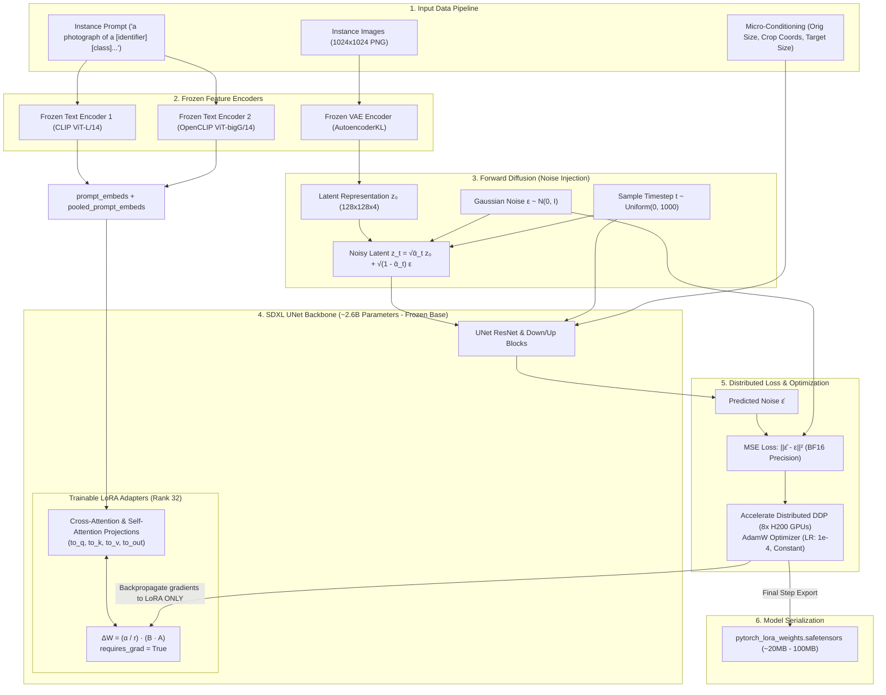

# AI Architecture and Distributed Training Guide

This document details the system architecture, neural pipeline, infrastructure setup, and distributed training mechanics implemented in the `ai-build-tools` suite for fine-tuning Stable Diffusion XL (SDXL) using DreamBooth LoRA on multi-GPU bare-metal clusters.

---

## 1. High-Level Architecture Diagram

The training pipeline isolates the base model components in frozen states, injecting lightweight trainable low-rank matrices (LoRA) exclusively into the UNet attention projections.



---

## 2. Neural Network Components & Role Breakdown

The fine-tuning architecture combines **DreamBooth** (few-shot subject binding) with **LoRA** (Low-Rank Adaptation) on the **SDXL Base 1.0** foundation model:

| Component | Implementation | Parameters / Precision | State During Training | Role |
|---|---|---|---|---|
| **VAE** | `AutoencoderKL` | ~84M / FP32 or BF16 | **Frozen** (`requires_grad=False`) | Compresses $1024\times 1024\times 3$ RGB input images to $128\times 128\times 4$ latent space $z_0$. |
| **Text Encoder 1** | `CLIPTextModel` (ViT-L/14) | ~123M / FP16 | **Frozen** (`requires_grad=False`) | Tokenizes prompt text and extracts standard semantic token embeddings. |
| **Text Encoder 2** | `CLIPTextModelWithProjection` (OpenCLIP ViT-bigG/14) | ~695M / FP16 | **Frozen** (`requires_grad=False`) | Generates high-capacity text representations and pooled text projections. |
| **UNet Backbone** | `UNet2DConditionModel` | ~2.6B / BF16 | **Frozen** (`requires_grad=False`) | Denoising diffusion backbone that models spatio-temporal latent structures across timesteps. |
| **LoRA Adapters** | Low-rank matrices ($A \times B$) | Rank $r=32$, Scale $\alpha=32$ | **Trainable** (`requires_grad=True`) | Injected into attention projections (`to_k`, `to_q`, `to_v`, `to_out`). Stores delta weights $\Delta W$. |

### Why the Base Model is Frozen
1. **Catastrophic Forgetting Prevention:** Freezing the 3.5B base parameters prevents the model from degrading its generalized understanding of physics, styles, lighting, and language.
2. **Compute & VRAM Efficiency:** Gradient history and optimizer states (AdamW first/second moments) are only tracked for the low-rank adapters, reducing memory overhead from tens of gigabytes to minimal footprint.
3. **Portability:** Instead of saving full multi-gigabyte checkpoints, the pipeline emits a compact, portable weight file (`pytorch_lora_weights.safetensors`, ~20–100 MB).

---

## 3. Infrastructure & Execution Environment

The training pipeline runs on bare-metal GPU nodes managed via OpenStack Ironic:

```text
┌─────────────────────────────────────────────────────────────────────────┐
│ Control Node (control01)                                                │
│  - Orchestrates OpenStack Nova/Ironic bare-metal instance lifecycle     │
│  - Stages pinned SDXL base snapshot & verified dataset manifests        │
│  - Builds & archives network-isolated container image                   │
│  - Executes phased run coordinator (run-all.sh)                         │
└────────────────────────────────────┬────────────────────────────────────┘
                                     │ SSH (IPoIB / Ethernet)
                                     ▼
┌─────────────────────────────────────────────────────────────────────────┐
│ GPU Bare-Metal Node (GPU01 - 8x NVIDIA H200, 141GB VRAM each)           │
│                                                                         │
│  ┌───────────────────────────────────────────────────────────────────┐  │
│  │ Workload Docker Container (--network none --gpus all)             │  │
│  │                                                                   │  │
│  │   CUDA 12.8 / Driver 580.x ── PyTorch 2.8+cu128 ── Diffusers      │  │
│  │                                                                   │  │
│  │   Accelerate DDP (8-way Data Parallelism across H200s)            │  │
│  │   └── train_dreambooth_lora_sdxl.py                               │  │
│  │         ├── Inputs: /models/base (ro), /data (ro)                 │  │
│  │         └── Output: /outputs/pytorch_lora_weights.safetensors     │  │
│  └───────────────────────────────────────────────────────────────────┘  │
│                                                                         │
│  Background Telemetry: nvidia-smi poller -> gpu-telemetry.csv (30s)     │
└─────────────────────────────────────────────────────────────────────────┘
```

---

## 4. End-to-End Training Lifecycle

The orchestrator (`run-all.sh`) enforces strict progression through guarded phases:

```
[00-preflight] ──> [10-deploy] ──> [20-accept-guest] ──> [30-pilot]
       │
       └──> [40-train] ──> [50-generate] ──> [60-package] ──> [70-finalize]
```

### Phase Breakdown

1. **`00-preflight`:** Verifies OpenStack quotas, MAC addresses, network subnets, base model checksums, and dataset JSONL manifests before allocating GPU time.
2. **`10-deploy`:** Provisions or adopts the bare-metal server using Nova/Ironic with ConfigDrive and cloud-init boothooks.
3. **`20-accept-guest`:** Installs NVIDIA drivers and CUDA runtime on the guest OS, validates Fabric Manager, and verifies PyTorch and JAX across all 8 GPUs.
4. **`30-pilot`:** Executes a brief low-step test run to verify filesystem write access, CUDA tensor operations, and container boundaries.
5. **`40-train`:**
   * Mounts input base models and datasets in read-only mode (`:ro`).
   * Runs `accelerate launch` with BF16 mixed precision and rank-32 LoRA for 300 steps.
   * Logs continuous GPU telemetry (power, temperature, VRAM usage).
   * Validates zero `NaN`/`Inf` loss values upon completion.
6. **`50-generate`:** Executes multi-prompt inference against the trained adapter at 1024×1024 resolution.
7. **`60-package`:** Generates checksum manifests, verifies non-blank image outputs, and builds the immutable release bundle.
8. **`70-finalize`:** Records run metadata, marks completion, and manages node retention.

---

## 5. Hyperparameter Reference

| Parameter | Configuration | Description |
|---|---|---|
| **Base Model** | `SDXL Base 1.0 (fp16)` | Snapshot commit `462165984030d82259a11f4367a4eed129e94a7b` |
| **LoRA Rank ($r$)** | `32` | Rank dimension for low-rank decomposition matrices |
| **LoRA Alpha ($\alpha$)** | `32` | Scaling factor applied to LoRA weight updates |
| **Resolution** | `1024 x 1024` | Native SDXL training resolution |
| **Train Batch Size** | `1` per GPU | Distributed across 8 GPUs (effective batch size = 8) |
| **Gradient Accumulation**| `1` | Number of update steps before backward pass synchronization |
| **Learning Rate** | `1e-4` | Optimizer learning rate |
| **LR Scheduler** | `constant` | Learning rate schedule throughout training |
| **Warmup Steps** | `0` | Warmup steps for learning rate |
| **Max Train Steps** | `300` | Total optimization steps |
| **Mixed Precision** | `bf16` | Bfloat16 training precision on H200 Tensor Cores |
| **Instance Prompt** | `"a detailed photograph of a cbear cute little brown bear"` | Unique binding identifier (`cbear`) and class (`cute little brown bear`) |

---

## 6. Inference with the Trained Adapter

Post-training inference loads the base model and layers the generated `pytorch_lora_weights.safetensors` on top:

```python
import torch
from diffusers import StableDiffusionXLPipeline

# 1. Load frozen base model
pipeline = StableDiffusionXLPipeline.from_pretrained(
    "/models/base",
    torch_dtype=torch.float16,
    variant="fp16",
    use_safetensors=True,
)
pipeline.to("cuda")

# 2. Attach trained LoRA adapter
pipeline.load_lora_weights(
    "/outputs",
    weight_name="pytorch_lora_weights.safetensors",
)

# 3. Generate image
image = pipeline(
    prompt="a detailed photograph of a cbear cute little brown bear sitting in a meadow, high resolution, 8k",
    num_inference_steps=30,
    guidance_scale=7.5,
    height=1024,
    width=1024,
).images[0]

image.save("output.png")
```
